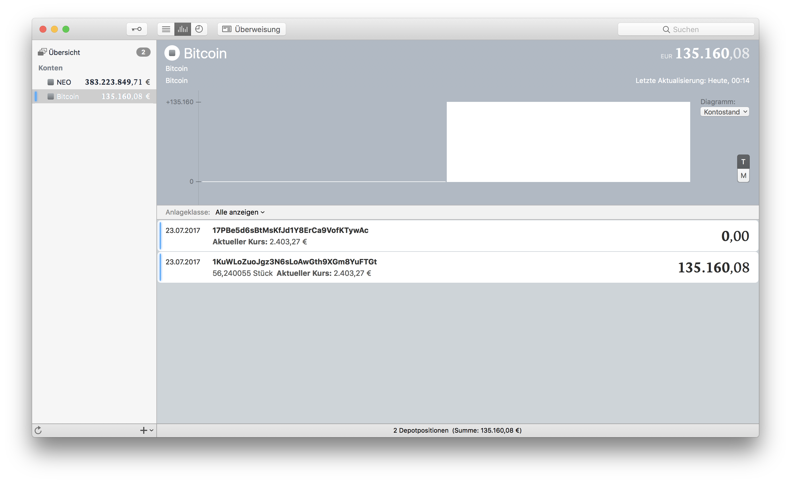

# Bitcoin-Cash-MoneyMoney
Fetches amount and value of privately held Bitcoin Cash address via blockexplorer and returns it as a security.  
This can be also be used to track your cold storage.

Do you like this extension?
Donation Bitcoin Cash address: `1BUCR5Rh8FpN2SJmrHWnnR78hmgmKyiiWn`

## Extension Setup

You can get a signed version of this extension from

* my [GitHub releases page](https://github.com/Jacubeit/Bitcoin-Cash-MoneyMoney/releases/tag/v0.1), or
* the [MoneyMoney Extensions](https://moneymoney-app.com/extensions/) page

Once downloaded, move `Bitcoin Cash.lua` to your MoneyMoney Extensions folder.

**Note:** This extension requires MoneyMoney **Version 2.3.3** or newer.

## MoneyMoney Setup

Add a new account (type "Bitcoin Cash"). 

**Use your Bitcoin Cash adresses coma seperated as user name**  
`1KuWLoZuoJgz3N6sLoAwGth9XGm8YuFTGt, 1KuWLoZuoJgz3N6sLoAwGth9XGm8YuFTGt` (example)

**Use whatever you want as password**  
`123` (example)

